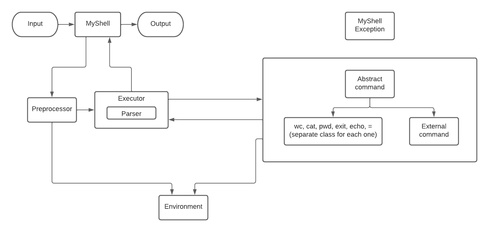

# Software Design course 2022

Команда: Субботина Олеся, Анисимова Карина, Багрянова Катя

____

## Описание архитектуры

### MyShell

Основной класс, запуск происходит из него

* Стандартные потоки ввода и вывода
* Чтение запроса
* Запуск Preprocessor и Executor
* Получение результата Executor и вывод его в поток вывода
* Обработка исключений

### Environment

Класс, в котором хранятся переменные окружения — словарь

Считаем, что все переменные хранятся в одинарных кавычках

### Preprocessor

Класс для предобработки запроса

Предобработка: делаем подстановку переменных, обрабатываем кавычки. (Обновление текущих переменных окружения на ходу не поддерживается)

Обработка: один проход по строке.

Чтобы корректно обрабатывать кавычки храним самую левую незакрытую:
* Если кавычки еще не встречены -  просто делаем подстановки, пока не встретим первую кавычку.
* Если двойная - делаем все подстановки и считаем одинарные кавычки просто символами, пока не встретим закрывающую двойную.
* Если одинарная - считаем ее содержимое строкой, подстановки не делаем, пока не встретим ее закрывающую.

Поддерживаемые виды переменных:
* Одна цифра
* Набор букв и цифр, начинающийся с буквы

Символы кроме букв и цифр не поддерживаются. Переменные, начинающиеся с цифры, длины > 1 не поддерживаются.

Процесс подстановки:
* Набор переменной:
  * Если встретили цифру после знака $, то добавляем после нее пробел, чтобы разбить аргументы вида `$1x` на `$1 x`, считаем, что нашли переменную `$1`
  * Иначе после знака $ набираем переменную, пока не встретим символ, отличный от буквы или цифры
  * Если после знака $ переменная не набралась - оставляем $. (`echo $` выведет $, `echo $$$` - $$$)
* Подстановка:
  * Если такая переменная была ранее запомнена в environment, то делаем подстановку, иначе удаляем
  * Из-за того, что все переменные хранятся в одинарных кавычках, двойной подстановки никогда не произойдет

### Executor

Класс для выполнения запроса

Компоненты:
* Метод executeAll: 
  * Инициализирует парсер
  * В цикле обращается к методу getNext парсера
  * Проверяем, что существует класс, соответствующий этой команде. 
  Если команда поддерживаемая — отдаем ее статические и динамические аргументы предыдущей команды 
  (см. в описании класса команды) конкретному классу для этой команды. Иначе отдаем в класс CommandExternal 
  * Запускаем у команды метод execute.
  Получаем результат исполнения команды (сохраняем его в переменную) и передаем его как динамические следующей команде.
  * Смотрим на код возврата очередной команды. В случае ошибки пользователь видит соответствующее сообщение,
  В случае, если текущая команда была exit - выходим из цикла и завершаем работу MyShell.
  * Возвращаем итоговый результат (результат последней команды).
* Класс Parser: парсит строку на команду и аргументы
  * Инициализируем целой строкой, полученной после предобработки
  * Метод getNext - отрезает очередную слева часть запроса по пайпу, если это еще возможно. 
  Затем по пробелам разбивает ее на команду и аргументы. 
  Возвращает массив строк, в котором первый элемент - сама команда, остальные - ее аргументы.

### Abstract Command

Абстрактный класс, описывающий функциональность команды

Команда поддерживает два вида аргументов:
* Статические: аргументы, переданы команде напрямую
* Динамические: аргументы, которые получены как результат выполнения предыдущей команды
* Логика обработки статических и динамических аргументов зависит от конкретной команды

Коды возврата:
* Код, соответствующий успешному выполнению команды
* Код, соответствующий ошибке некорректности аргумента
* Код, соответствующий ошибке при выполнении команды
* Код, соответствующий завершению работы

Компоненты:
* Поля: статические и динамические аргументы (2 массива строк, в каждой конкретной команде будем кастовать к нужным типам),
logger, exit code
* Методы: 
  * execute — выполняет команду и возвращает результат и exit code, соответствующий успешному выполнению команды либо ошибке при выполнении команды
  * валидация аргументов — проверяет корректность аргументов
* От него наследуются классы конкретных команд, класс внешних команд, класс для обработки присваивания

Команды: 
* Класс CommandCat
  * Валидация аргументов: 
    * Статические: если одного из файлов не существует или аргументов нет, 
    то возвращаем код возврата, соответствующий ошибке некорректности аргументов
    * Динамические: ожидается ноль или один аргумент - строка. Воспринимается как содержимое файла.
  * execute: 
    * Если есть статические аргументы - динамические игнорируются
    * Иначе используем динамические
    * Читаем содержимое файлов, конкатенируем через '\n' и возвращаем
* Класс CommandEcho 
  * Валидация аргументов: любая комбинация аргументов валидна
  * execute
    * Если есть статические аргументы - динамические игнорируются
    * Иначе используем динамические
    * Возвращаем строку, полученную конкатенацией переданных аргументов через пробел. Если аргументов нет - возвращаем пустую строку
* Класс CommandWc
  * Валидация аргументов:
    * Статические: если одного из файлов не существует или аргументов нет,
      то возвращаем код возврата, соответствующий ошибке некорректности аргументов
    * Динамические: ожидается ноль или один аргумент - строка. Воспринимается как содержимое файла.
  * execute:
    * Если есть статические аргументы - динамические игнорируются
    * Иначе используем динамические
    * Считаем количество строк, слов и байт в файле, конкатенируем по файлам через '\n', возвращаем
* Класс CommandPwd
  * Валидация аргументов: игнорируем аргументы
  * execute: возвращаем текущую директорию
* Класс CommandExit
  * Валидация аргументов: игнорируем аргументы
  * execute: возвращает exit code, соответствующий завершению работы
* Класс CommandExternal
  * Валидация аргументов: не валидируем
  * execute: 
    * Передаем и статические, и динамические аргументы
    * Реализован с использованием Java.Process
* Класс CommandAssignment
  * Валидация аргументов: 
    * Статические: если количество аргументов != 2 (переменная и значение), то возвращаем код возврата, 
    соответствующий ошибке некорректности аргумента
    * Динамические: игнорируются
  * execute: обновляем или создаем переменную окружения в environment

____

### Поток исполнения:
Запуск происходит из MyShell. На вход принимается строка от пользователя и передается в Preprocessor.
В нем выполняются подстановки переменных из Environment с учетом кавычек, возвращает результат.
Строка с подстановками передается в метод executeAll Executor'а. 
В executeAll с помощью Parser разбиваем строку на команды по пайпам. Команды последовательно передаются
на обработку соответствующим классам этих команд. В них валидируются
аргументы команды, команды выполняются и возвращается результат и exit code.
По завершении последней команды либо в случае кода возврата результат выполнения
передается в MyShell и выводится пользователю. Ожидается слудающий пользовательский ввод.
В случае кода возврата exit выполнение программы завершается.

____

## Схема архитектуры

  

  
